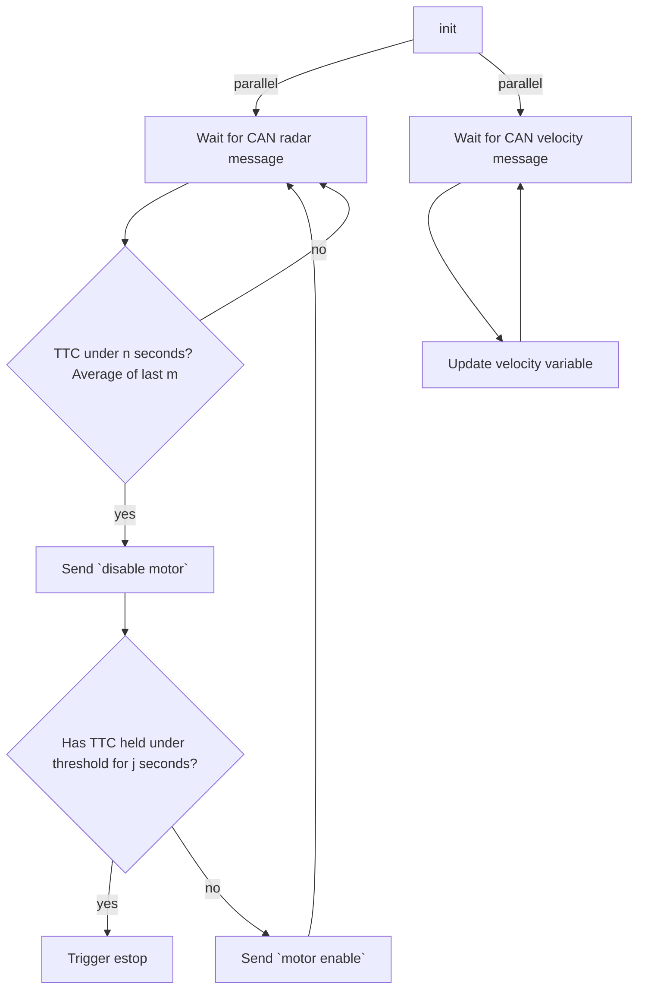

# Automatic Emergency Braking

## Overview
The Automatic Emergency Braking (AEB) system is designed to be a supplemental safety system
for the automatic driving. The goal of AEB is to lower the speed of the kart as much as possible
before a potential collision, to mitigate the damage to both objects. This is necessary as the E2E inference
is non-deterministic, and thus requires additional deterministic safety systems to ensure functional safety.    

## Inputs
- **Two Radars** - to reduce noise.
- **Encoder data** - used to determine kart velocity.

## Outputs 
- **EStop** - direct connection to Estop circuit to allow for emergency braking.
- **Motor Start/Stop messages** - Sent over CAN.

## Algorithm:

