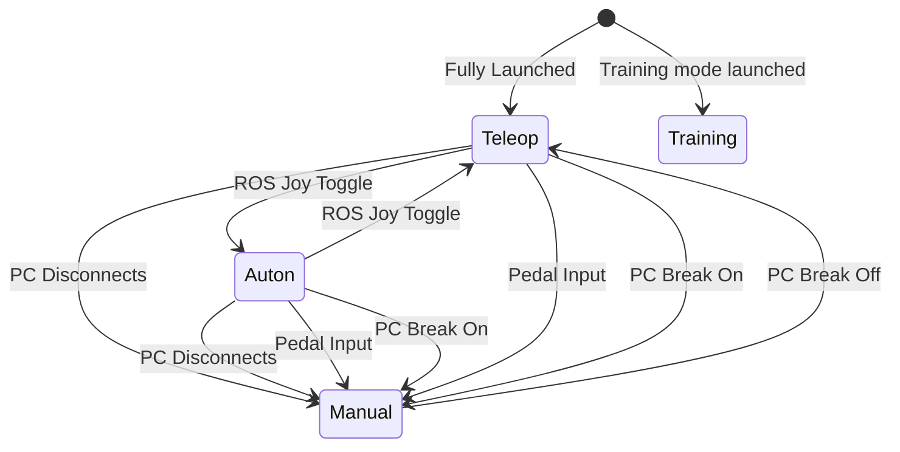

# State Machine

Phoenix's high level state machine contains all the conceptual states the kart can enter.
This state machine is accurate at a high level, but may not be explicitly stored in every subsystem.

