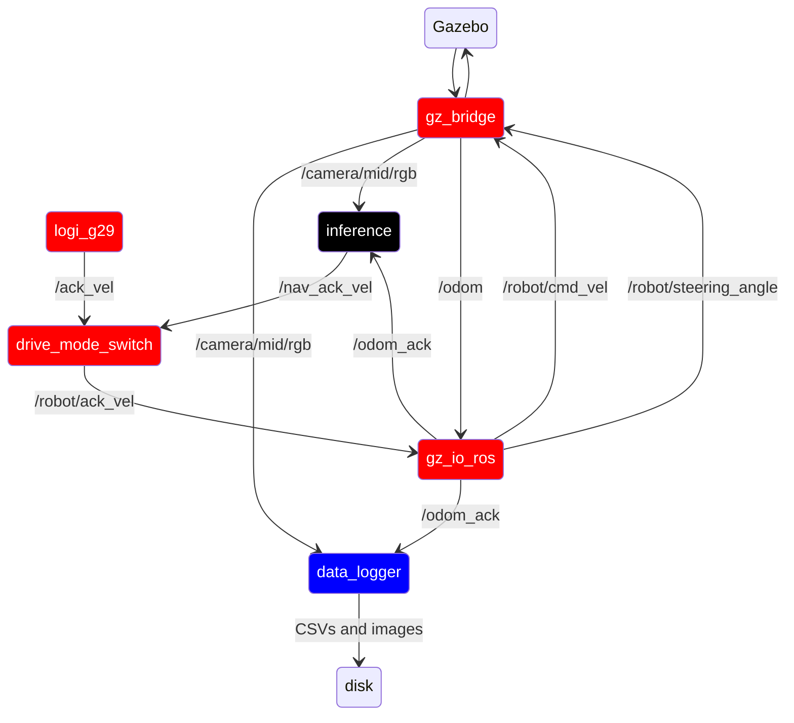

# Phoenix_gazebo

This package contains the launch files for running phoenix in its gazebo simulation environment. Overall, this package
should attempt to be a virtual version of [phoenix_robot](phoenix_robot.md) as close as possible.

there are three main launch files:
- prod.launch.py: Runs the production version of phoenix
- data_collect.launch.py: Runs phoenix in data collection mode
- common.launch.py: Launch file that launches nodes common between the above two files (including teleop)

## Ros Config

Red = common.launch.py

Black = prod.launch.py

Blue = data_collect.launch.py

(TODO update after rest of nodes are done)
