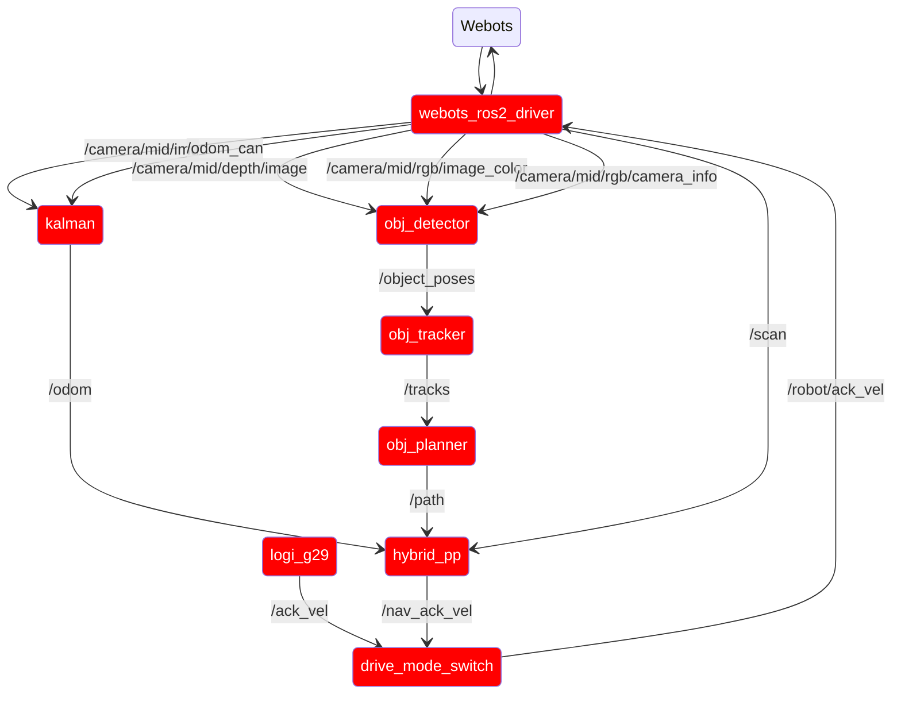
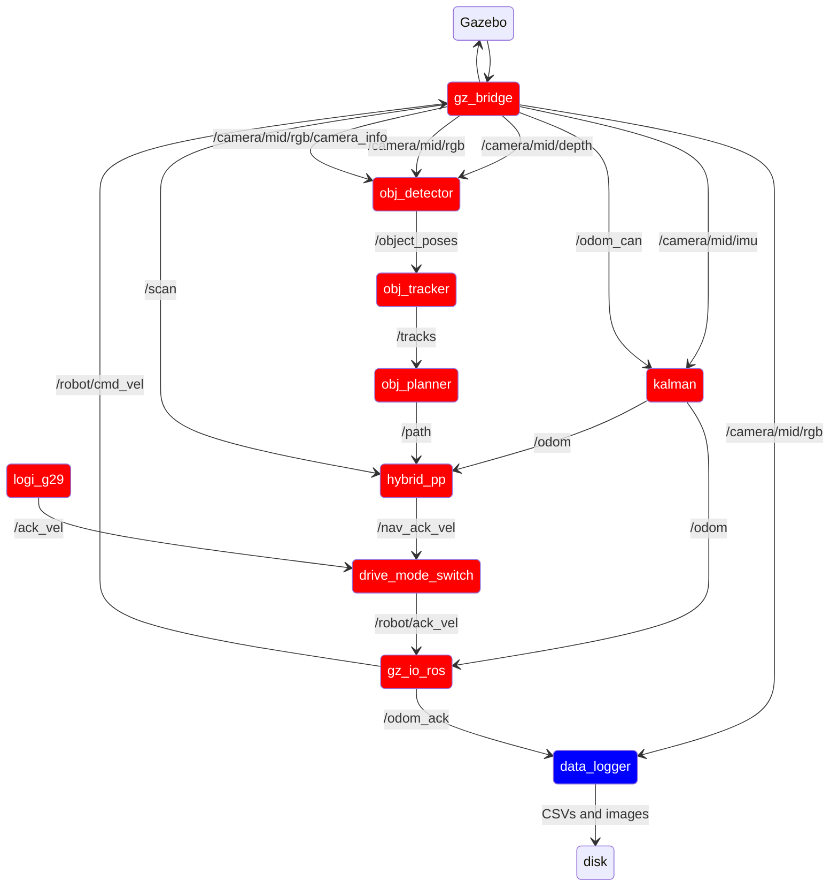

# Phoenix_gazebo

This package contains the launch files for running phoenix in its simulation environments. Overall, this package
should attempt to be a virtual version of [phoenix_robot](phoenix_robot.md) as close as possible.

there are three main launch files:

- prod.launch.py: Runs the production version of phoenix
- data_collect.launch.py: Runs phoenix in data collection mode
- common.launch.py: Launch file that launches nodes common between the above two files (including teleop)

Critically, common can be launched with either Gazebo or Webots as its simulation environment. Currently, Webots is the
preferred environment.

## Ros Config

Red = common.launch.py

Black = prod.launch.py

Blue = data_collect.launch.py

### Webots mode:

Note that webots_ros2_driver will appear in rqt as /Phoenix

#### webots setup

First, install webots. Inside the phoenix_gazebo package, there is a webots_project folder. This folder contains the
files for webots. The go-kart track world contains the physics config and structure of the world. This file can be
edited
and saved in webots without ROS entirely, which is an efficient way to update the world. This world imports two Protos (
basically urdfs for webots), one for the bot itself and the other for cones. Phoenix's proto is adapted from its urdf
file,
but only loosely. It inherits from webots Car proto, which enables it to use powertrain simulation and the driver API,
which makes wb_io_ros significantly easier to implement. The webots_ros2_driver reads tags from the urdf to bridge some
drivers over, however these devices must also be in the proto. Because of this, _both_ the urdf and proto must be
updated when a sensor location or setup changes. This is because the proto will handle the sim sensor location, and the
urdf will handle the location of that sensors ros frame, so any split between these two will lead to error.

### Gazebo mode:

