# Phoenix_gazebo

This package contains the launch files for running phoenix in its gazebo simulation environment. Overall, this package
should attempt to be a virtual version of [phoenix_robot](phoenix_robot.md) as close as possible.

there are three main launch files:
- inference.launch.py: Runs the production version of phoenix, using the NN inference to drive the kart
- data_collect.launch.py: Runs phoenix in data collection mode, labeling images for offline training
- common.launch.py: Launch file that launches nodes common between the above two files

## Ros Config

Red = common.launch.py

Black = inference.launch.py

Blue = data_collect.launch.py

Currently, github isn't on mermaid 9.3.0, so we can't embed this mermaid directly.
Here's the [source](https://mermaid.live/edit#pako:eNqNVMFq4zAQ_RUh6C0hsEcdemmhvWwvgZ4MYiyNHbWSJozkhLb03yvFrQt2kl1fbI_evDfzNNKHNGRRKpkyZLx30DOE9eFPE0V5jIeU7rEThkKgWF6eWB13LuOqc94rRjtDWsiwxLV-wBlwz2TPAcG8NnHE3tyIR2B7BEbhYkbuwGAa1x7gHVsS6_Wt6N91y872qJQaCx0hy_gJPmZehdQmtKe-Ry4L9U-JjYGADJvg7Ib79mp-CTvSTGkKl3yyFMasqbu6BrHaEDOT98jf3Vl2B9ShbI1OR5fNbsE_ky38TC3ljQlWH9D_L82yzDM0L_SmM-mMHmmv89GlPPProk717Ydqars662I_WTgr4vIWVAv1aUBO3S0gY6ZLr0rcbZ-TqN66AH0dmkn96emqsIsdMkZTva0zupCdA_7tQITDr5kXRuaM7Hzg5EqWQABny3n9qGyNzDsM2EhVPiMOmcE3somfBQpDpu1bNFJlHnAlh739PeFSdeBTiaJ1mfjveAecroLPL8aVYvo)
