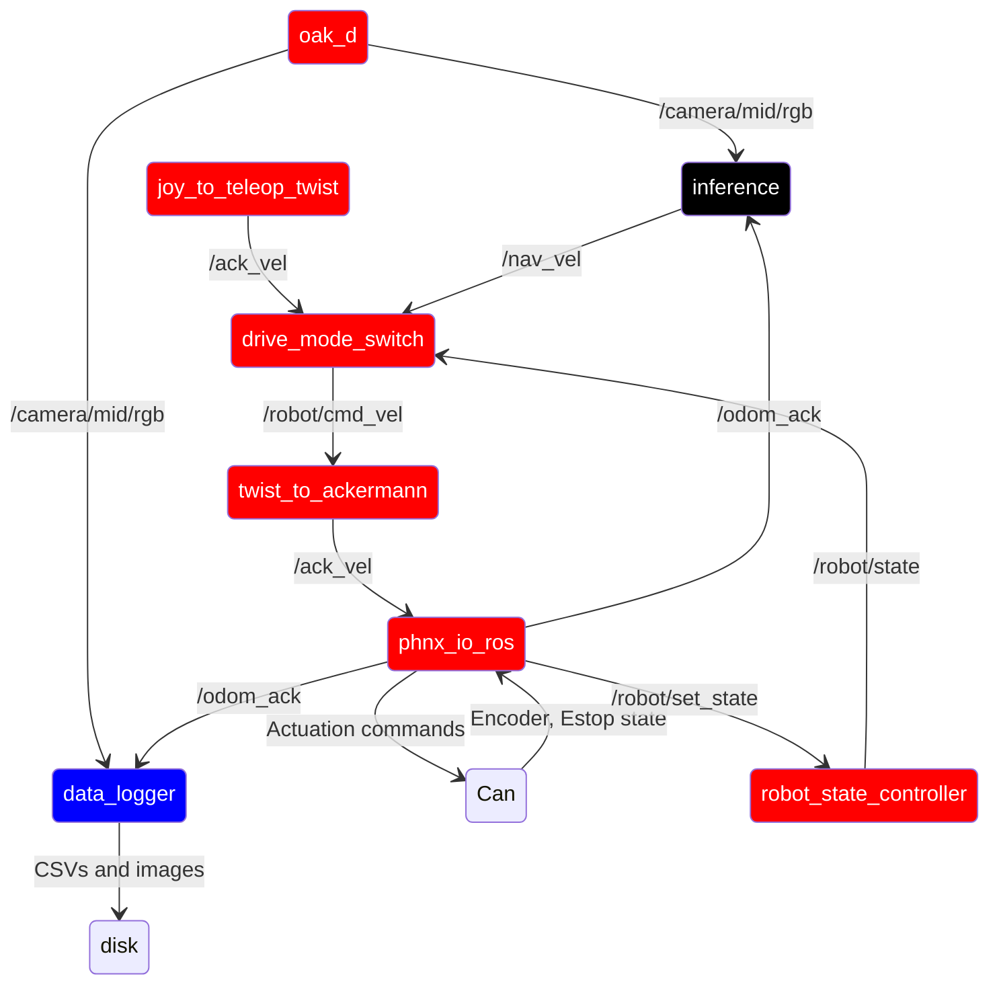

# phoenix_robot

This package contains launch files for running phoenix IRL.

there are three main launch files:

- inference.py.launch: Runs the production version of phoenix, using the NN inference to drive the kart
- data_collect.py.launch: Runs phoenix in data collection mode, labeling images for offline training
- common.py.launch: Launch file that launches nodes common between the above two files

## Ros Config

Red = common.py.launch

Black = inference.py.launch

Blue = common.py.launch

