# phoenix_robot

This package contains launch files for running phoenix IRL.

there are three main launch files:

- inference.py.launch: Runs the production version of phoenix, using the NN inference to drive the kart
- data_collect.py.launch: Runs phoenix in data collection mode, labeling images for offline training
- common.py.launch: Launch file that launches nodes common between the above two files

## Ros Config

Red = common.py.launch

Black = inference.py.launch

Blue = common.py.launch

Currently, github isn't on mermaid 9.3.0, so we can't embed this mermaid directly.
Here's the [source.](https://mermaid.live/edit#pako:eNqFVE1v4yAQ_SsIqbdElvbIYaVVW2kv20ulPVlCE5g4bPiIBpxsVfW_LwbXUR1n7QsY3nvzZhh45ypo5ILHBAmfDHQEbnv-1nqWP2UhxifcMxWcCz4PNpC4HEzCzd5YKwj1DKkhwS1uZ3ucAU8U9BIQ1LH1FfvwwH4C6QsQMuMT0h4UxroX4Ci1EGJ0tt1-L6GlDV2HlDeGP8EaBQ4JGmd0Q92uch-hEk4H_1eaICnESUmwZz-UhDbsOaZwYqUwlbeEL0JZULAfKvWQTCmTc-D16HTKZVzOo08UrEUaEeliYpIpyJw7Usb4r_LLPpuMlme0VUOTOaN02bmMF5PU4avEf0JkJQq7kBrl9FXvT3gb4AkthpMs9Fm17wacW5sKUEr5mf5KSYslWRjyWrBb0xFHVNVboa07H1Wr4uR86CrjuxXPiw0YdHCyNHU5phtIZZp4FOzx9XdkQ4cYB93Q6FP8l5c6NX6PhF5hJpcLtJqPh_P1JBYuzVzxzpW5m_MC_zNjvuFu6DWj8_vyPui0PB3QYctFnnrsE4Ftees_MhT6FF7fvOIiUY8b3p_09UXiYg825lXUJgX6Vd-s8nR9_ANx1qMI)