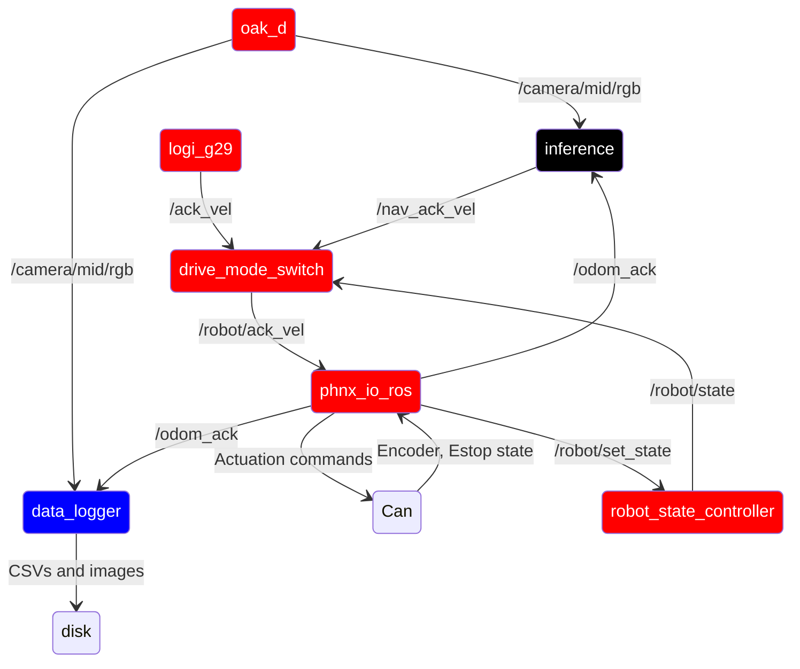

# phoenix_robot

This package contains launch files for running phoenix IRL.

there are three main launch files:

- inference.launch.py: Runs the production version of phoenix, using the NN inference to drive the kart
- data_collect.launch.py: Runs phoenix in data collection mode, labeling images for offline training
- common.launch.py: Launch file that launches nodes common between the above two files

## Ros Config

Red = common.launch.py

Black = inference.launch.py

Blue = common.launch.py

