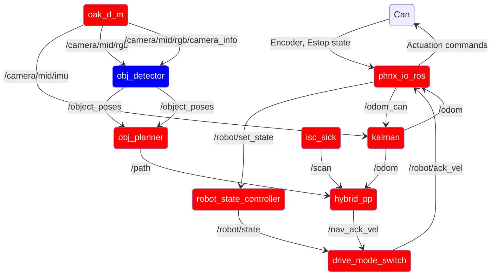

# phoenix_robot

This package contains launch files for running phoenix IRL.

there are two main launch files:

- prod.launch.py: Runs the production version of phoenix
- common.launch.py: Launch file that launches nodes common between the above two files
- ultilibot.launch.py: Launch file used on a remote computer networked to the kart. Launches
teleop nodes.

## Ros Config

Red = common.launch.py

Black = prod.launch.py

Purple = utilibot.launch.py

Blue = common.launch.py

