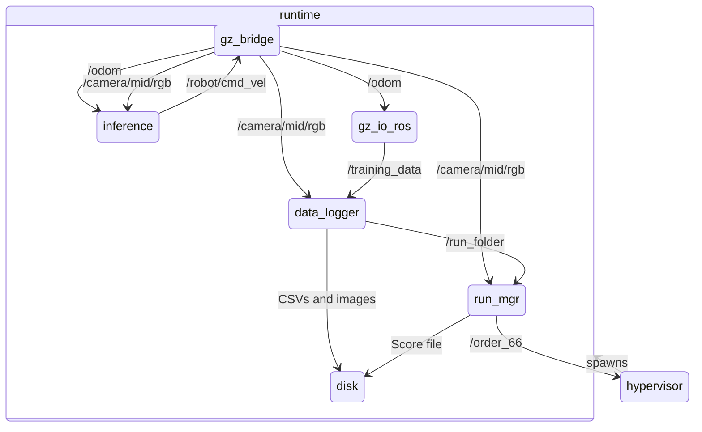
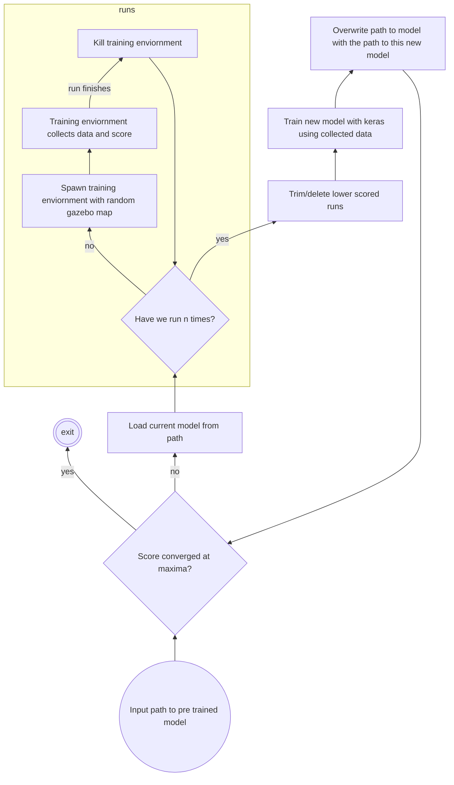

# Phoenix_training

This is the package used for training the NN automatically. It assumes you have a prior trained weights file from IRL or
gazebo collected data,
and will then begin the gazebo data collection loop automatically.

The entry point to this package is the [hypervisor node](hypervisor.md).

## ROS structure

This is the logical node structure of the training loop.

## Scoring Algorithm

Scoring is archived by pointing a camera in gazebo towards a colored strip under the ground. This colored strip
represents the desirable area for the kart to be in. The run should lose points if the camera stops seeing this color.
This camera is also used for finding the finish line to end runs.

## Algorithm (implemented by hypervisor)

The overall training algorithm:

- Load prior weights
    - Until model is deemed fit:
        - for 1 to n:
            - have hypervisor spawn `Ros2 launch phoenix_training training.py.launch` process, loading a random gazebo map
            - gazebo will collect data and write score to a file
            - kill `Ros2 launch phoenix_training training.py.launch` process when run is done (`/order_66`)
        - hypervisor trims bad runs based on score
        - hypervisor uses Keras to train NN using trimmed data
        - load new weights

Visualised:

## Training data format

TODO detail data format
