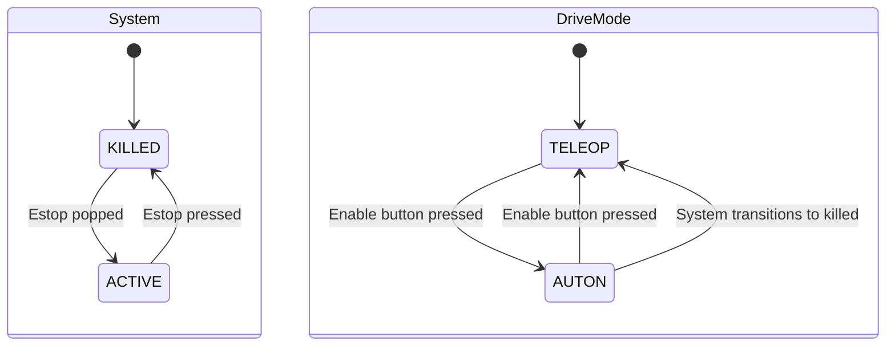

# State management

This document will discuss the software half of Phoenix's state management. This takes two forms: the system state, and
the drive mode state.

Here are the state diagrams of each:

The idea is that the kart should never move unexpectedly, and thus we need to sync with hardware to ensure this is the
case. When the hardware is killed, we cannot move the kart. However, the computer and bus must stay alive, so we need
to consider that our software must be tolerant to sitting killed, then being enabled again some time later.

To achieve this, we have two seperate states. The system state models the state of the estop system. When killed,
no messages from either teleop or auton will be sent to CAN. While the kart would reject these regardless, this gives
another layer of safety. In addition, controls like the speed loop can listen for this transition, to avoid things
like integral windup while the kart is disabled.

The drive mode is similar, but can be toggled by hand. When in teleop, only controller inputs are accepted, while auton
is the opposite. This is toggled with a button on the controller. Whenever someone would be near the kart to enable it,
this loop _must_ be in teleop for safety. When the kart boots, it starts in teleop for this reason. When the kart is
killed, it is also put into teleop for this reason, as that allows for the kart to be in teleop when enabled again.